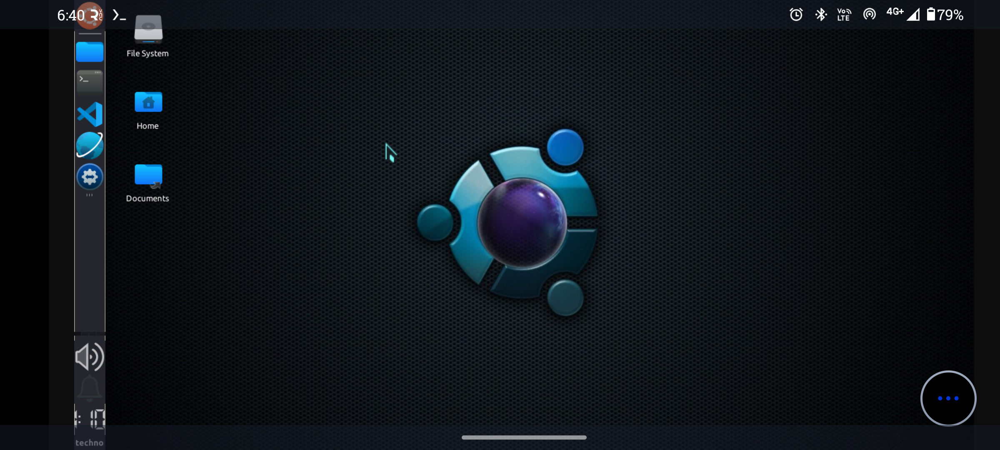
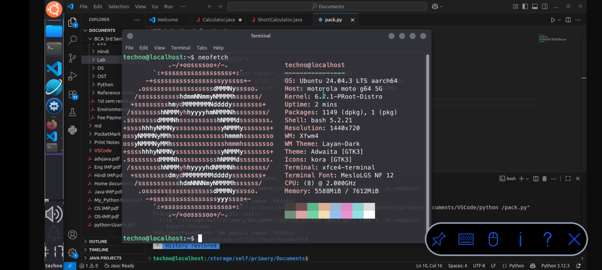
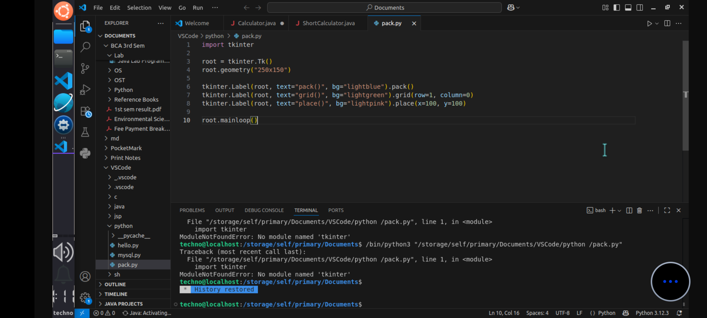

# How To Install Ubuntu 24.04 On Android Without Root

This repository provides a **complete step-by-step guide** to set up a **full Ubuntu 24.04 LTS development environment on Android without root**, including **Desktop GUI**, **Gedit**, **Turbo C**, **Python**, **Java with Tomcat**, **GCC**, and **VS Code (code-server)**.

---

## 📸 Screenshots / Preview

### 🖥️ Ubuntu 24.04 Desktop (GUI on Android)


> Ubuntu 24.04 running with full desktop GUI inside Termux (No Root)

---

### ℹ️ System Information (Neofetch)


> Hardware, OS, kernel, memory details using `neofetch`

---

### 💻 VS Code (code-server) on Ubuntu


> VS Code running inside Ubuntu 24.04 on Android

---

## 📑 Index (Quick Navigation)

- [Setup Order](#-setup-order-important)
- [Required Apps](#-required-apps-apk-links)

### Main Installation
- [Ubuntu 24.04 Installation (With GUI)](#-ubuntu-2404-installation-with-gui)
- [Access Ubuntu Desktop (VNC)](#-access-ubuntu-desktop-vnc)

### Editors & Languages
- [Install Gedit](#-install-gedit-text-editor)
- [Install Turbo C / Turbo C++](#-install-turbo-c--turbo-c-dosbox)
- [Install Python](#-install-python-with-pip--venv)
- [Install Java + Tomcat](#-install-java--apache-tomcat)

### Configuration
- [JAVA_HOME Setup](#-java_home-setup)
- [Configure JAVA_HOME for Tomcat](#-configure-java_home-for-tomcat)

### Extra Tools
- [Install GCC / G++](#-install-gcc--g)
- [Install VS Code (code-server)](#-install-vs-code-code-server)

### Quick Install
- [One-Command Ubuntu Setup](#-one-command-ubuntu-setup-base-install)

- [Conclusion](#-conclusion)

---

## 📘 Setup Order (IMPORTANT)

Follow this order strictly for best results:

1. Ubuntu 24.04 + Desktop GUI  
2. Gedit  
3. Turbo C / Turbo C++  
4. Python  
5. Java + Tomcat  
6. Other tools (GCC, VS Code)

---

## 📲 Required Apps (APK Links)

### 🔹 Termux (Mandatory)
❌ Do NOT install from Play Store

- https://f-droid.org/packages/com.termux/
- https://github.com/termux/termux-app/releases

---

### 🔹 VNC Viewer (GUI Access)

- https://play.google.com/store/apps/details?id=com.realvnc.viewer.android

---

# 1️⃣ Ubuntu 24.04 Installation (With GUI)

### Update Termux
```bash
apt update && apt upgrade -y
````

### Install Required Tools

```bash
pkg install wget git -y
```

### Download Ubuntu Script

```bash
wget https://raw.githubusercontent.com/modded-ubuntu/modded-ubuntu/refs/heads/master/setup.sh
```

### Give Permission

```bash
chmod +x setup.sh
```

### Install Ubuntu

```bash
./setup.sh
```

* Type `y` whenever asked
* Allow storage permission

---

### Restart Termux

Close and reopen the app.

---

### Start Ubuntu

```bash
ubuntu
```

### Create Ubuntu User

```bash
bash user.sh
```

* Lowercase username
* No spaces

---

### Restart Termux Again

Close → reopen.

---

### Launch Ubuntu

```bash
ubuntu
```

---

## 🖥️ Install Desktop GUI

```bash
sudo bash gui.sh
```

Set a **VNC password**.

---

## 🖱️ Access Ubuntu Desktop (VNC)

```bash
ubuntu
vncstart
```

VNC Viewer Settings:

* Address: `localhost:1`
* Name: `ubuntu`
* Quality: **High**

---

# 2️⃣ Install Gedit (Text Editor)

```bash
sudo apt update
sudo apt install -y gedit
```

Run:

```bash
gedit
```

---

# 3️⃣ Install Turbo C / Turbo C++ (DOSBox)

### Install DOSBox

```bash
sudo apt install -y dosbox
```

### Create Turbo C Directory

```bash
mkdir -p ~/turboc
```

📌 Copy Turbo C files (`TC`, `BIN`, `BGI`) into `~/turboc`

---

### Run Turbo C

```bash
dosbox
```

Inside DOSBox:

```text
mount c ~/turboc
c:
cd tc/bin
tc
```

---

# 4️⃣ Install Python (with pip & venv)

```bash
sudo apt install -y python3 python3-pip python3-venv
```

Check versions:

```bash
python3 --version
pip3 --version
```

---

# 5️⃣ Install Java + Apache Tomcat

## Install Java (OpenJDK)

```bash
sudo apt install -y openjdk-17-jdk
java -version
```

---

## ⚙️ JAVA_HOME Setup

Find Java path:

```bash
readlink -f $(which java)
```

Edit bashrc:

```bash
nano ~/.bashrc
```

Add:

```bash
export JAVA_HOME=/usr/lib/jvm/java-21-openjdk-arm64
export PATH=$JAVA_HOME/bin:$PATH
```

Reload:

```bash
source ~/.bashrc
```

Verify:

```bash
echo $JAVA_HOME
java -version
```

---

## 🌐 Install Apache Tomcat

```bash
wget https://dlcdn.apache.org/tomcat/tomcat-10/v10.1.44/bin/apache-tomcat-10.1.44.tar.gz
tar -xvzf apache-tomcat-10.1.44.tar.gz
mv apache-tomcat-10.1.44 tomcat
```

Start Tomcat:

```bash
cd tomcat/bin
chmod +x *.sh
./startup.sh
```

Access:

```
http://localhost:8080
```

Stop:

```bash
./shutdown.sh
```

---

## ⚙️ Configure JAVA_HOME for Tomcat

```bash
nano ~/tomcat/bin/setenv.sh
```

Add:

```bash
export JAVA_HOME=/usr/lib/jvm/java-21-openjdk-arm64
export PATH=$JAVA_HOME/bin:$PATH
```

```bash
chmod +x setenv.sh
./shutdown.sh
./startup.sh
```

---

# 6️⃣ Other Tools

## Install GCC / G++

```bash
sudo apt install -y build-essential
```

---

## Install VS Code (code-server)

```bash
sudo apt install curl -y
curl -fsSL https://code-server.dev/install.sh | sh
```

Run:

```bash
code-server --bind-addr 0.0.0.0:8081
```

Stop:

```bash
pkill code-server
```

Run in background:

```bash
nohup code-server --bind-addr 0.0.0.0:8081 &
```

---

## ⚡ One-Command Ubuntu Setup (Base Install)

```bash
apt update && apt upgrade -y && pkg install wget git -y && wget https://raw.githubusercontent.com/modded-ubuntu/modded-ubuntu/refs/heads/master/setup.sh && chmod +x setup.sh && ./setup.sh
```

---

## ✅ Conclusion

You now have a **complete Ubuntu 24.04 programming and development environment on Android** with:

* Desktop GUI
* Gedit
* Turbo C / Turbo C++
* Python
* Java + Tomcat
* GCC & VS Code

🎓 Perfect for **students, developers, and learning programming on mobile devices**.

---

## 🧩 Troubleshooting

### Ubuntu command not found
```bash
pkg install proot-distro
```
### VNC not Connecting
```bash
vncstop
vncstart
```
Sure 👍
Here is a **clean, ready-to-paste `.md` snippet** for **only those two issues**, written professionally for your README.

---

````markdown
### ❗ Desktop UI is Slow

If the Ubuntu desktop feels slow or laggy:

- Reduce VNC screen resolution
- Set VNC picture quality to **Medium** instead of High
- Close unused background apps on Android
- Avoid running heavy applications simultaneously
- Recommended device: **4 GB RAM or higher**

Restart VNC if needed:
```bash
vncstop
vncstart
````

---

### ❗ Turbo C Doesn’t Start in DOSBox

If Turbo C does not open or shows errors:

1. Make sure Turbo C files are placed correctly:

```
~/turboc
```

Required folder structure example:

```
turboc/
 └── TC/
     ├── BIN/
     ├── BGI/
     └── INCLUDE/
```

2. Start DOSBox:

```bash
dosbox
```

3. Inside DOSBox, run:

```text
mount c ~/turboc
c:
cd tc/bin
tc
```

4. If it still doesn’t start:

* Recheck folder names (case-sensitive)
* Ensure `tc.exe` exists inside `TC/BIN`

---

Happy Coding 🐧🚀

